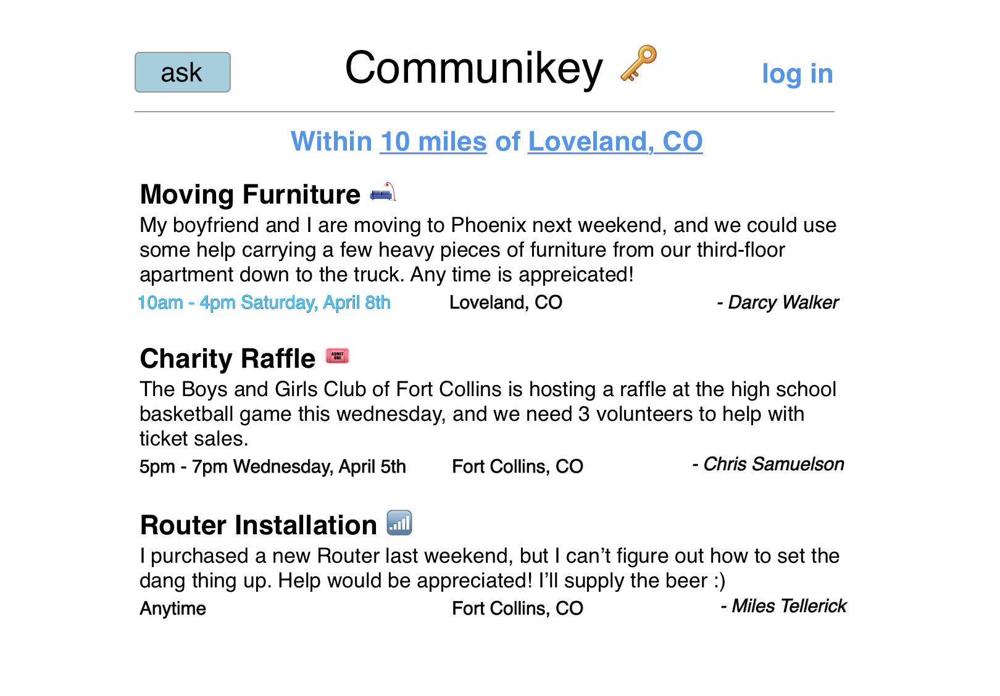
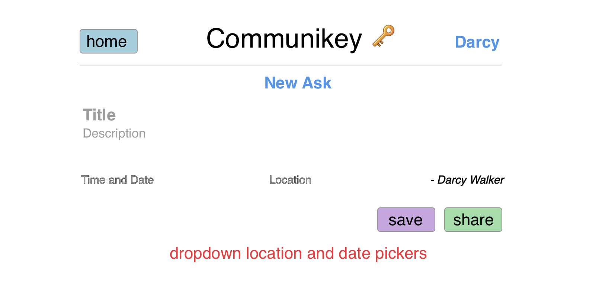
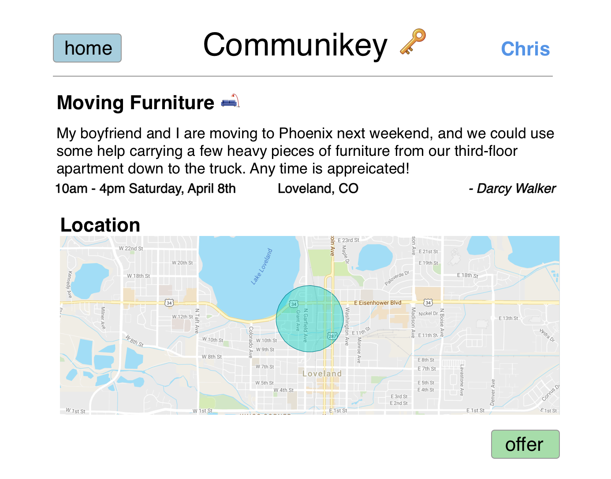

# Communikey

## What is Communikey?
Communikey connects volunteers with local volunteer opportunities. Users can
request volunteers if they need help, or browse and commit to volunteer
opportunities if they have time/energy to give.

### Why Volunteering?
Volunteering is a wonderful way to make friends and improve your community.
Volunteering makes us healthier, happier people.

For more, read [Volunteering and its Surprising
Benefits](https://www.helpguide.org/articles/work-career/volunteering-and-its-surprising-benefits.htm)

### Problem:
As great as volunteering is, there's a lot of friction involved. Formal
volunteer opportunities (eg animal shelters, nursing homes, schools, soup
kitchens) often require lengthy/involved applications and hours of training.
Those who survive the gauntlet are then asked to make weekly time commitments
that can be hard to keep with busy, variable schedules. Because of the time and
commitment required, many people who would like to volunteer don't.

### Hypothesis:
**People would volunteer more if it were easier.**

### Goal:
Volunteering should be frictionless. I want local opportunities that work with
my schedule and allow me to leverage my skills.

In addition to formal volunteer opportunities, I also want to be notified when
someone in my neighborhood needs my help, whether it's moving boxes or setting
up their WiFi.

There are volunteer opportunities all around us. Our neighbors could
use our help more often than we realize (and visa versa), but it can be socially
difficult/awkward to request/offer help. If we knew _how_ we could
help others, we'd do it more often.

### Example Volunteer Opportunities
1. Sam, an 80 year-old neighbor needs help getting to and from the grocery
store on Saturdays.
1. Christie is moving apartments and could use help from a few able-bodied
people moving heavy furniture for an hour.
1. The Boulder Shambala Center is hosting a party to celebrate the changing
seasons and needs 5 people to help run the raffle.
1. Chelsea needs help doing her taxes.
1. Dan needs help changing the oil in his car.
1. Poudre Valley High School needs 7 chaperones for an upcoming field trip.

## Development

MVP Stage 1: Craigslist for volunteer opportunities. Users can create accounts,
then CRUD volunteer opportunities. Opportunities require a title, description,
location, contact info, and time. Users can only edit their own posts, but they
can view all.

Stage 2: Filter posts by location. View posts that are within x miles of you or
another specific location. Add tags to posts, filter by tags.

Stage 2: Users can commit (register) for volunteer opportunities. Post creators
can Request a certain number of people... users can offer to help... creators
can accept help.

Stage 3 and beyond: Calendar integration. Recommendations, notifications. Social
Media Features.

## Potential Features

### Calendar integration
- Volunteers indicate when they're available on a calendar, highlighting blocks of time
  they're free to help someone in need. Communikey notifies them when there are
  opportunities during their free time.
- When you 'commit' to a volunteer opportunity, it is added to your personal
  calendar.

### Recommendations
- Location - what's in walking distance? Driving distance? Etc.
- Interests/causes listed in your profile people your friends have helped.
- Services you are willing/able to render
- Receive notifications when someone in your area needs makes a post that
  matches your preferences

### Admin features ($)

## Revenue
- $1 per volunteer recruited through Communikey?  Hourly charge? $/person/hour?
  Corporations could sponsor Communikey over certain periods of time. "All requests for help are
  free today thanks to Coca Cola."
- Branded communities
- Promoted posts

## Managing Trust
- You have to say that you'd like to help, and the person or organization has to
  agree to accept the help.
- People have profiles.  Organizations can verify if people belong.  When
  someone volunteers to help you, you can see what organizations they belong to
  and a history of what type of help they've provided in the past to others,
  making it easier to trust them.
- Communikey could help ease the paperwork burden for schools and similar
  organizations that require background checks or onerous applications.
  - perhaps Communikey could offer a common application form?

## Mockups

**Ask Index**

**New Ask**

**View Ask and Offer Help**

